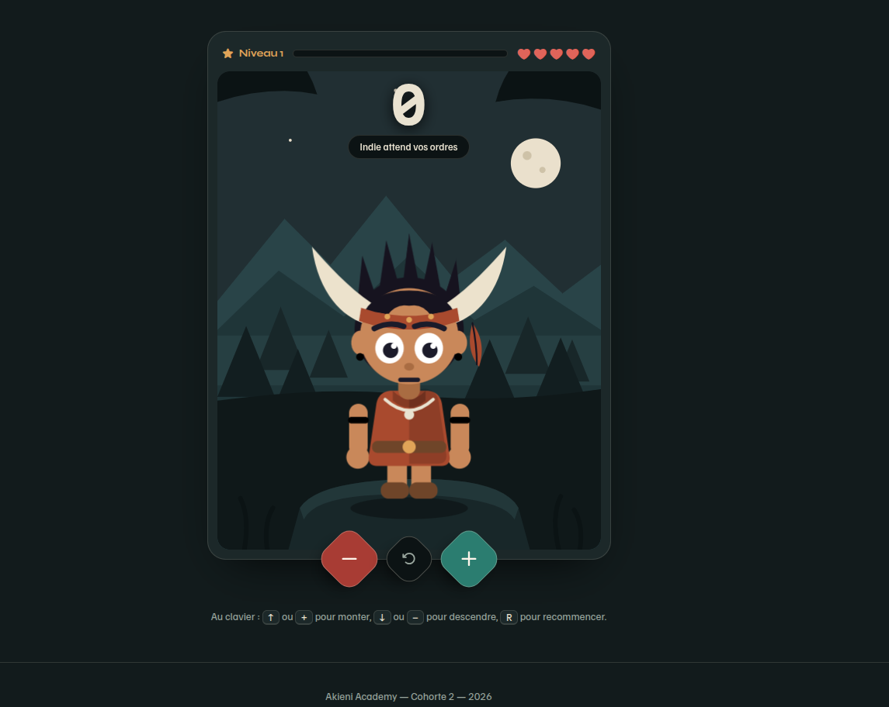
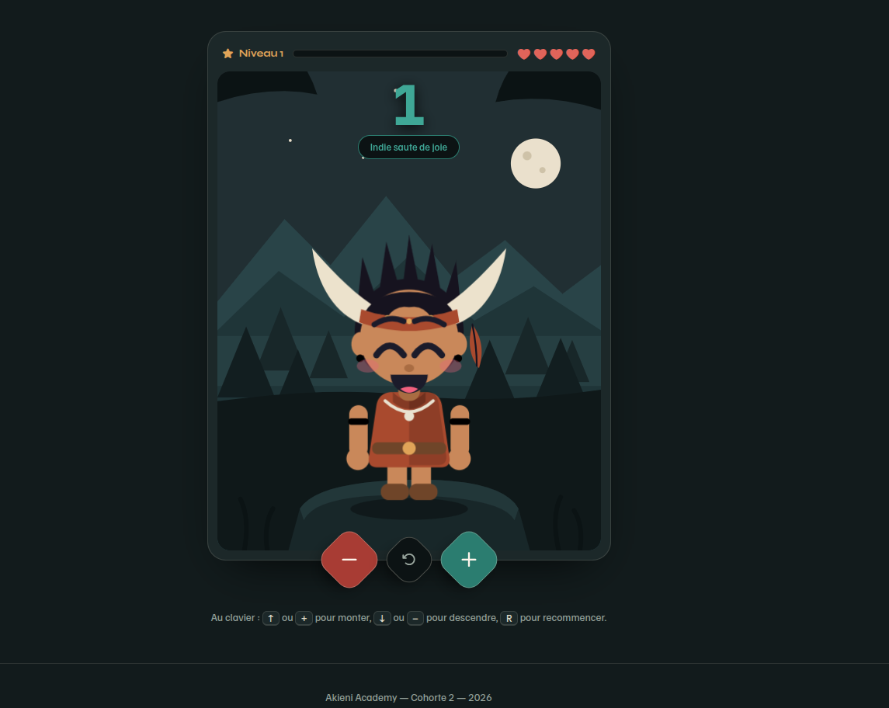
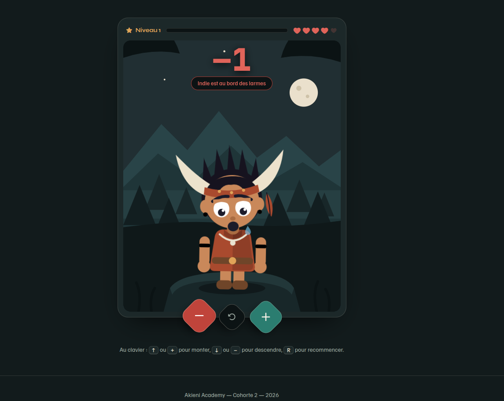
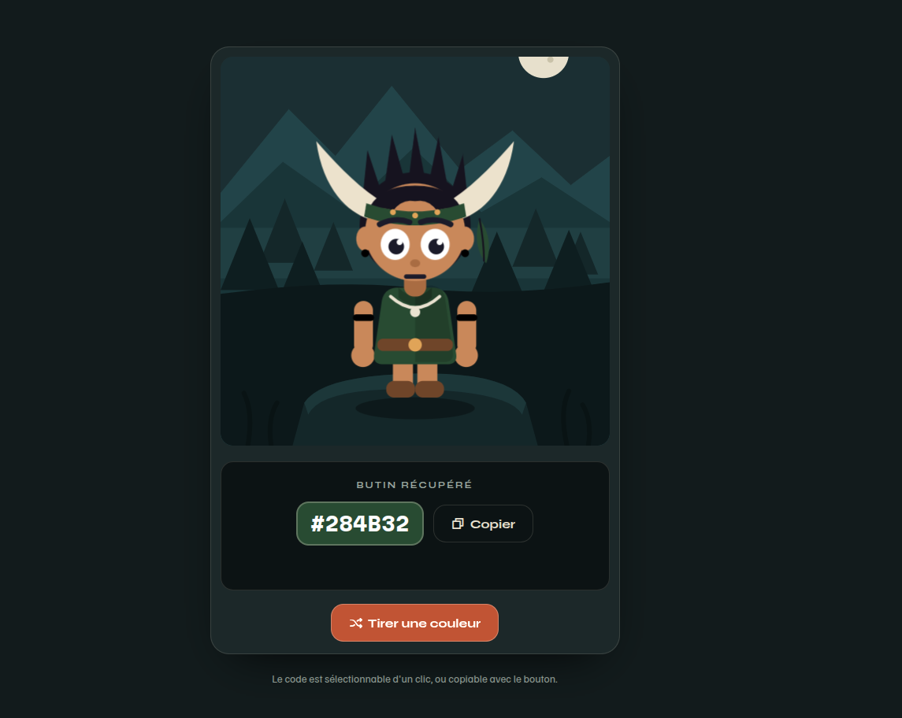
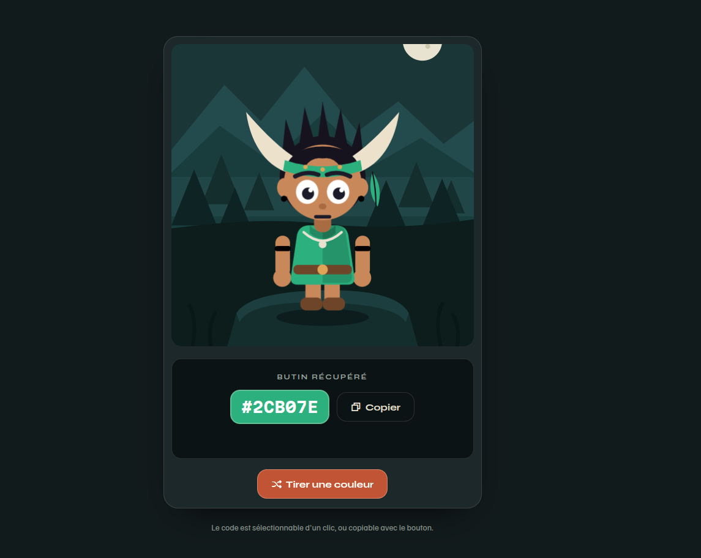

# La vallée du compteur — Compteur & Générateur de couleurs

Projet **débutant** de la semaine 10 (Akieni Academy — Phase 2, DOM & événements).

Deux mini-jeux réunis derrière une carte d'accueil, habillés comme une petite
application de jeu vidéo. Indie, la mascotte, est un SVG entièrement dessiné à
la main : elle respire en permanence, saute quand le score monte, et pleure
quand il passe sous zéro.

## Ce que fait le projet

### Terrain 1 — Le compteur (`compteur.html`)

- Trois commandes en losange : `−1`, remise à zéro, `+1`.
- Pilotable au clavier : `↑` / `+`, `↓` / `−`, et `R` pour recommencer.
- Le score change de couleur selon son signe et rebondit à chaque changement.
- **La mascotte réagit** : neutre à zéro, elle saute et scintille dans le vert,
  elle s'affaisse, sanglote et verse de vraies larmes dans le rouge.
- Le HUD est piloté par le score : le niveau et la barre d'expérience montent
  tous les 5 points, et chaque point négatif éteint un cœur.

### Terrain 2 — La teinturerie (`couleurs.html`)

- Un bouton tire une couleur au hasard et **repeint la tenue d'Indie** :
  tunique, bandeau, plume et voile de la scène.
- Une seule ligne de JavaScript suffit : `racine.style.setProperty("--tenue", couleur)`.
  Tous les éléments concernés lisent cette variable CSS, le navigateur fait le reste.
- Le code hexadécimal s'affiche en monospace sur une pastille de la couleur
  tirée, sélectionnable d'un clic ou copiable via l'API presse-papiers.
- **Bonus** : le texte du code bascule en clair ou en foncé selon la luminosité
  perçue de la couleur (`0.299 R + 0.587 V + 0.114 B`), pour rester lisible sur
  n'importe quel tirage.
- Indie fête chaque nouvelle tenue par un court saut de joie.

## Fichiers

```
01-compteur-couleurs/
  index.html      <- carte d'accueil, avec Indie en médaillon
  compteur.html   <- terrain 1
  couleurs.html   <- terrain 2
  style.css       <- feuille de style commune aux trois pages
  compteur.js     <- logique du compteur, du HUD et des humeurs
  couleurs.js     <- logique du tirage de couleur
  README.md
```

## Notions JavaScript travaillées

- `document.querySelector` et `querySelectorAll`
- `addEventListener` sur les boutons **et** sur le document (raccourcis clavier)
- `textContent`, `classList` (`add`, `remove`, `toggle`) et `setAttribute`
- `style.setProperty` pour écrire dans une variable CSS depuis le JavaScript
- `Math.random`, `toString(16)` et `padStart` pour fabriquer un code hexadécimal
- `navigator.clipboard` avec `try / catch` et repli explicite

## Le parti pris visuel

Style **dark cinématique + glassmorphism**, dans l'esprit des interfaces de jeu
mobile : c'est la direction que la recherche de design a fait ressortir pour
l'image de référence fournie.

- **Décor dessiné en SVG** : ciel dégradé, lune et son halo, montagnes,
  canopée, brume de vallée, plateforme rocheuse, herbes de premier plan.
  Aucune image bitmap, aucune requête réseau.
- **Trois halos flous** dérivent lentement derrière l'interface (`filter: blur`
  - `@keyframes`), pour que le fond ne soit jamais figé.
- **Panneaux en verre dépoli** : `backdrop-filter: blur(18px)`, bordure
  `rgba` d'un pixel, coins à 26 px, ombre portée profonde.
- **Commandes en losange** : des carrés arrondis pivotés à 45°, dont l'icône est
  contre-pivotée pour rester droite.
- **Typographie** : Fredoka pour les titres et le score, DM Sans pour le texte,
  JetBrains Mono pour les codes — avec repli système complet.
- Les deux couleurs sémantiques du gabarit d'origine, `#10b981` et `#ef4444`,
  sont conservées : elles restent le vert du score positif et le rouge du négatif.

## La mascotte, en détail

Indie est un seul `<svg>` d'environ 120 lignes. Le JavaScript ne touche jamais à
sa forme : il pose **une classe** sur la racine du SVG, et tout le reste est du CSS.

| Classe                        | Ce que le CSS déclenche                                                                                                  |
| ----------------------------- | ------------------------------------------------------------------------------------------------------------------------ |
| _(aucune)_ ou `avatar-neutre` | yeux ronds, bouche fermée, respiration lente                                                                             |
| `avatar-joyeux`               | yeux en croissant, bouche ouverte, joues rosées, saut, bras qui s'agitent, étincelles dorées                             |
| `avatar-triste`               | paupières tombantes, pupilles basses, bouche de sanglot, tête baissée, corps affaissé, deux larmes qui tombent en boucle |

Les trois expressions coexistent dans le SVG ; une seule est affichée à la fois
via `display`. Les larmes et les étincelles sont animées en `@keyframes`, et tout
le mouvement s'arrête si l'utilisateur a activé `prefers-reduced-motion`.

Deux pièges rencontrés, corrigés et à retenir :

- `transform-origin: center` sur un `<path>` SVG se réfère au **viewBox**, pas au
  path : il faut ajouter `transform-box: fill-box` pour que les étincelles
  tournent sur elles-mêmes.
- Une propriété `display` posée en CSS écrase l'attribut `hidden` du HTML ;
  la feuille de style pose donc explicitement `[hidden] { display: none !important; }`.

## Accessibilité

- Le score est en `aria-live="polite"` : sa valeur est annoncée à chaque changement.
- La barre d'expérience porte `role="progressbar"` et son `aria-valuenow` est
  tenu à jour.
- Les boutons icônes ont tous un `aria-label` explicite.
- Le décor et les halos sont en `aria-hidden` : ils ne polluent pas la lecture.
- Focus visible doré sur tous les éléments interactifs, cibles de 44 px minimum.

## Lancer le projet

Ouvrir `index.html` dans un navigateur — aucune dépendance, aucune installation.

## Capture d'écran

| Neutre                                                         | Joyeux                                                                 | Triste                                                                      |
| -------------------------------------------------------------- | ---------------------------------------------------------------------- | --------------------------------------------------------------------------- |
|  |  |  |

### Terrain 2 — La teinturerie

| Tenue verte                                                    | Tenue émeraude                                                |
| -------------------------------------------------------------- | ------------------------------------------------------------- |
|  |  |
